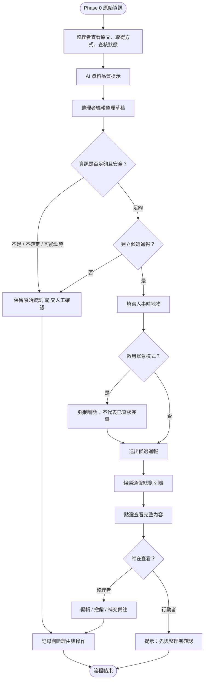

# v1 資訊流程設計

> 本文件由 Codex 根據 `docs/interview-summary.md`、`docs/decisions.md` 與 `release-packs/02-flow-design-kit` 產生草稿。
> 流程合理性需由人檢查，Mermaid 語法建議用 VS Code 預覽確認。

---

## 我的 v1 目標

- **我優先服務的使用者**：資訊整理者（Organizer）。
- **這個使用者最想完成的事**：把混亂的 Phase 0 原始資訊整理成下一位協作者能理解的候選通報，但不把不確定資訊包裝成已確認事實。
- **我最想避免的錯誤**：行動者把「候選通報」誤認為「可以出發的已確認任務」；AI 自動補上原文沒有的資訊；來源取得方式被誤會成查核結果。

---

## 自然語言流程描述

1. **原始資訊進入 v1 工作台**：資料仍來自 `src/fixtures/phase-0/messy-reports.json`，未新增任何 v1 fixture。
2. **整理者查看原始全文、取得方式與查核狀態**：取得方式只說明資訊怎麼進來，不等於可信度；查核狀態預設為未確認。
3. **AI 資料品質提示**：系統根據關鍵字提示可能問題（第三方轉述、地點模糊、時間不確定），但這只是 heuristics，不能決定資訊真假。
4. **整理者編輯整理草稿**：標出候選類型、信心程度、判斷依據、卡住點、下一步與是否不宜直接行動。
5. **判斷是否足夠形成候選通報**：
   - 如果資訊不足、來源不明、可能誤導行動者或缺少必要欄位 → 先保留原始資訊，標示「需要人工確認」或「暫時不要使用」，並記錄理由。
   - 如果資訊足夠 → 進入人事時地物表單建立候選通報。
6. **建立候選通報**：
   - 一般模式：需填寫人事時地物與聯絡。
   - 緊急模式：允許最少欄位，但送出前強制出現警語，狀態仍為「緊急候選（等待人工確認）」。
7. **候選通報總覽**：以列表呈現，點選才展開完整內容；每筆仍標示「尚未確認」。
8. **查看完整內容後的分支**：
   - 若是整理者查看：可以編輯、撤銷或補充備註。
   - 若是行動者查看：只能閱讀，系統提示「請先與整理者確認再採取行動」。
9. **紀錄**：每次建立、編輯、撤銷或人工判斷都留下時間戳與備註；撤銷僅從畫面清單移除，不取消任何真實任務。

---

## Mermaid 流程圖

---

## 人工確認點

- **整理者判斷「是否足夠且安全」**：只有人能決定原始資訊能不能進入候選通報，AI 只提供提示。
- **緊急模式送出前的警語確認**：系統可以阻擋「零資訊」送出，但「資訊仍不足時是否要送出緊急候選」由人決定。
- **行動者是否採取行動**：候選通報永遠不會變成「可執行」狀態，行動者必須先找人確認。

## 不能自動處理的分支

- **把未確認資訊標成已確認**：任何狀態變成「可執行」都不能由 AI 或系統自動完成。
- **自動補完地點、時間、電話、人物**：如果原文沒有，系統不能自動填寫，只能標示「缺少」或「需要人工確認」。
- **自動合併衝突資訊**：例如 M-006 兩個互相矛盾的回報，流程必須標示衝突並交人工確認，不能自動選一個版本。
- **自動判斷嚴重性是否觸發派遣**：嚴重性只是整理者的紀錄，不能直接變成行動指令。

## 操作或判斷紀錄

- 整理草稿的每一次人工修改都儲存在 React state（頁面內，非 localStorage），並顯示「已人工修正」。
- 候選通報的建立時間、緊急與否、審核備註都隨卡片保存。
- 撤銷通報時會從列表移除，但歷史時間戳與理由仍應在 `docs/ai-log.md` 留下紀錄。

## 我檢查後修正了什麼

### 修正 1：AI 提示不應影響分支

- **原本**：流程圖一開始把「AI 資料品質提示」畫成一個會直接影響後續分支的節點。
- **修正後**：把 AI 提示改成「僅供參考的提示」，後續分支由整理者判斷，避免看起來像 AI 在做決定。
- **為什麼**：訪談中 Organizer 與 Reporter 都擔心 AI 自動貼上的提示會被下一位協作者誤認為人工查核標記，流程必須明確區分「提示」與「人的判斷」。

### 修正 2：列表查看後的分支

- **原本**：點選查看完整內容後直接接「行動者查看？」的判定，若否就結束；這讓整理者沒有在總覽頁繼續編輯或撤銷的路徑，也把「不是行動者」預設成流程結束，語意不順。
- **修正後**：點選查看後改為「誰在查看？」，整理者可編輯/撤銷/補充備註，行動者只會看到「先與整理者確認」的提示，兩條路最後都留下紀錄才結束。
- **為什麼**：候選通報總覽不只是給行動者看的終點，整理者也會回頭審查與修正；把「誰在查看」獨立成判定，才能清楚表達兩種角色的不同權限。

## 我仍不確定的流程點

- 當整理者與行動者是同一個人時，「先與整理者確認」的提示是否還有效？
- 緊急模式的最小必填欄位是否應該強制留下聯絡方式或回報者身份？
- 候選通報長時間沒有人工確認時，是否需要「過期」機制？如果要，由誰標示？
